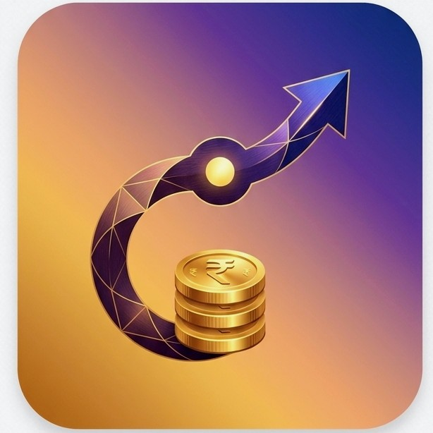

# 💰 MoneyFlow

> Track every rupee, effortlessly.



A beautiful, full-featured personal finance tracker that runs entirely in your browser — no server, no sign-ups, no data leaving your device.

## ✨ Features

- **🔐 Phone + OTP Login** — Secure authentication with simulated OTP (demo mode)
- **🤚 Biometric Login** — Fingerprint/Face ID for returning users
- **📊 Income vs Expense Tracking** — See your balance at a glance
- **🎯 Budget Management** — Monthly + per-category budget limits with visual progress bars
- **📈 Visual Charts** — Donut chart for categories, bar chart for 6-month trends
- **👥 Split Bills** — Divide expenses among friends
- **🔄 Recurring Bills** — Track subscriptions and monthly payments
- **🔍 Search & Filter** — Find transactions by name, category, or type
- **💾 Persistent Storage** — All data saved in localStorage across sessions
- **📱 Mobile-First** — Responsive design optimized for phones

## 🚀 Quick Start

### Option 1: Open directly
Just double-click `index.html` — it works in any modern browser.

### Option 2: GitHub Pages
1. Fork this repo
2. Go to **Settings → Pages**
3. Set source to `main` branch, root folder
4. Your app will be live at `https://yourusername.github.io/moneyflow/`

### Option 3: Local server
```bash
# Python
python -m http.server 8000

# Node.js
npx serve .
```

## 📁 Project Structure

```
moneyflow/
├── index.html          # Complete app (single file, zero dependencies)
├── manifest.json       # PWA manifest for installability
├── assets/
│   ├── icon.jpeg       # App icon (rounded)
│   └── logo.jpeg       # Logo (splash screen)
├── README.md
├── LICENSE
└── .gitignore
```

## 🛠️ Tech Stack

- **Pure HTML/CSS/JS** — No React, no build tools, no npm
- **localStorage** — For persistent data storage
- **SVG Charts** — Hand-crafted donut & bar charts
- **Google Fonts** — DM Sans + Playfair Display
- **CSS Animations** — Smooth transitions and micro-interactions

## 🎨 Design

Inspired by modern fintech apps like Axio, with a premium purple-gold color scheme and clean, card-based layout.

## 📝 Notes

- **OTP is simulated** — The demo shows the OTP on screen. For production, integrate with Firebase Auth, Twilio, or MSG91
- **Biometric is simulated** — Real biometric auth requires HTTPS + WebAuthn server
- **Data is local** — Everything stays in your browser's localStorage. Clearing browser data will erase all records

## 📄 License

MIT License — free to use, modify, and distribute.
